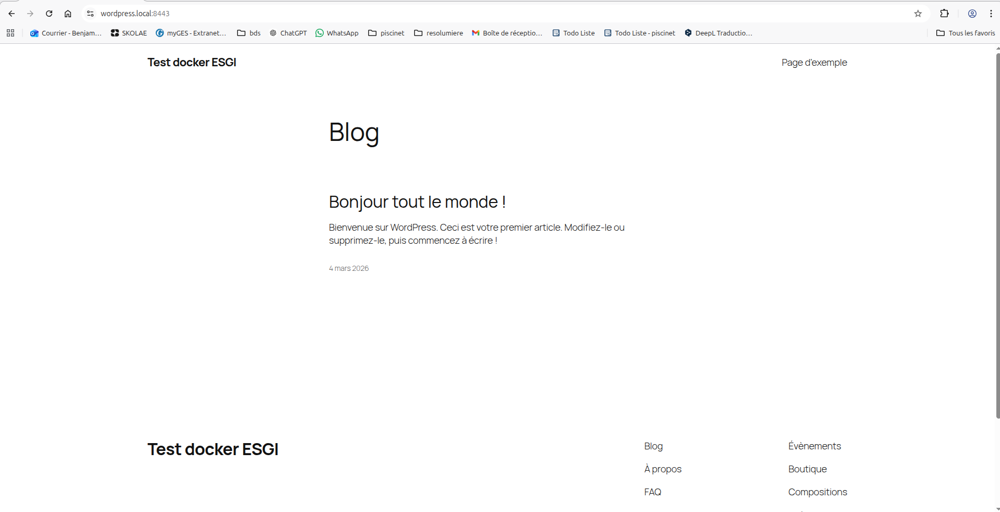
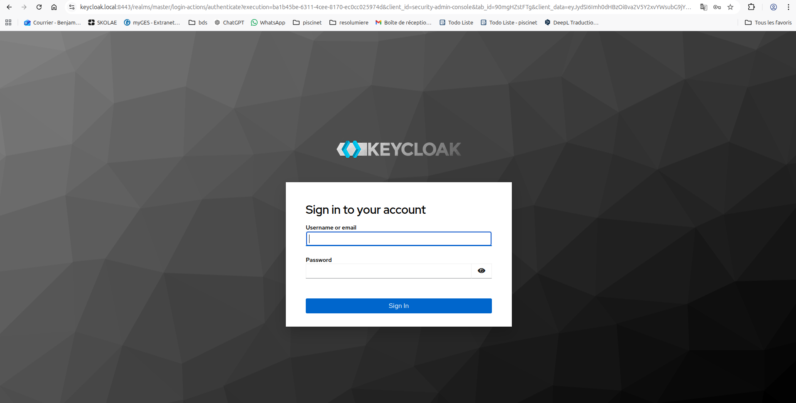
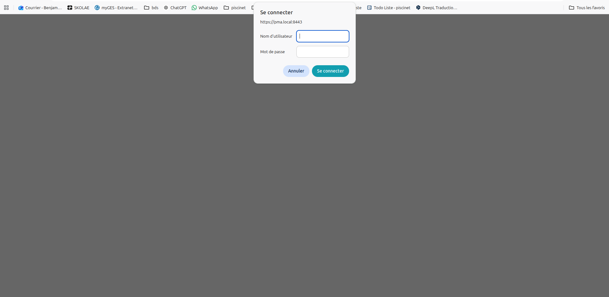
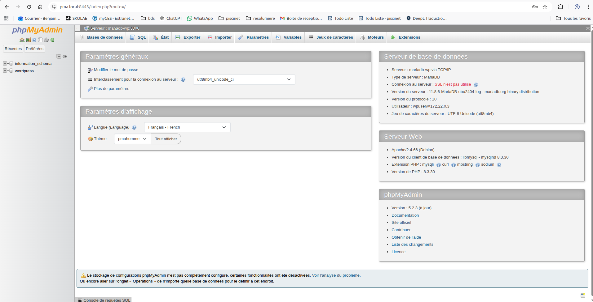
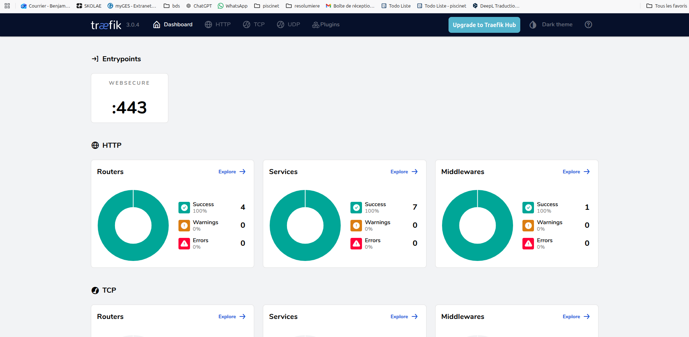
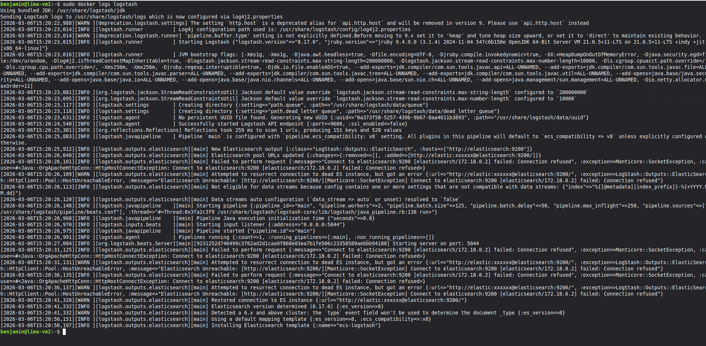
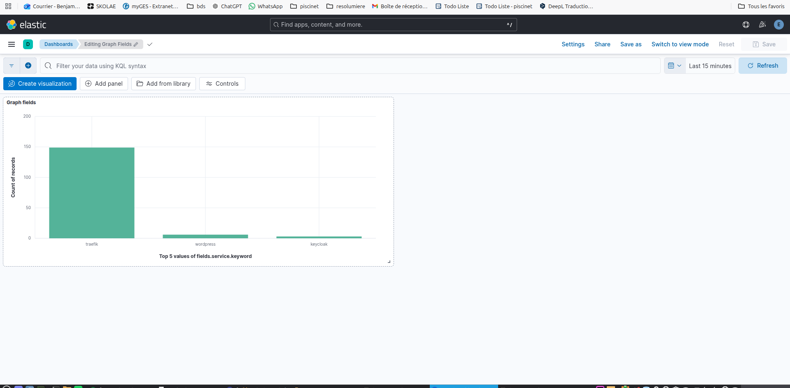
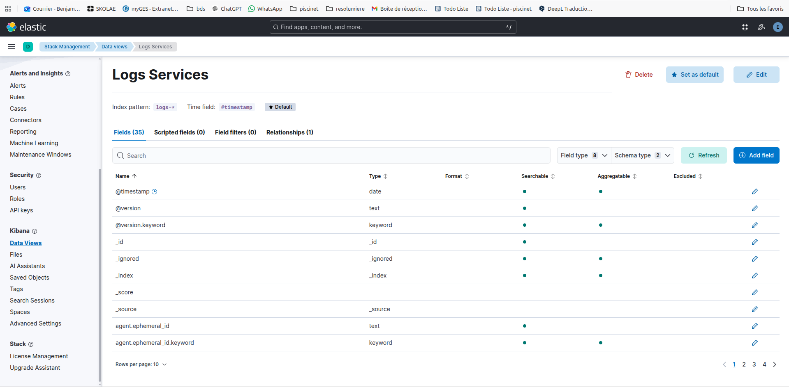
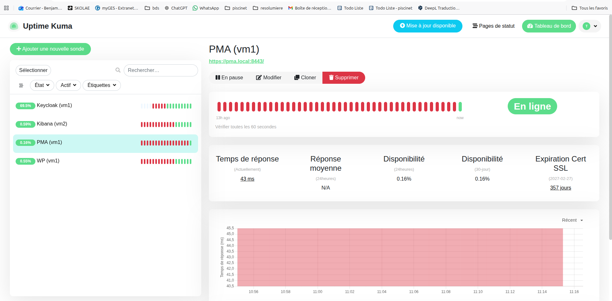

# Rapport de Projet : Infrastructure Haute Disponibilité et Observabilité

## 1. Objectifs et Architecture
L'objectif est de simuler un environnement de production segmenté en trois pôles distincts pour garantir la performance, la sécurité et la clarté de l'administration.

### Répartition des services :
* **VM1 (App)** : Cœur de métier (WordPress, MariaDB), gestion d'identité (Keycloak) et administration DB (phpMyAdmin).
* **VM2 (Logs)** : Analyse comportementale et stockage des logs (ELK).
* **VM3 (Ops)** : Surveillance de la santé des services (Uptime Kuma).

---

## 2. Analyse des Services Déployés

### Pôle Applicatif (VM1)
Nous utilisons **Traefik v3** comme point d'entrée unique. Il gère le SSL (certificats auto-signés) et le routage intelligent via Docker Labels.
* **WordPress** : CMS principal. 
* **Keycloak** : Serveur d'authentification pour wordpress 
* **phpMyAdmin** : Interface de gestion, doublement protégée par une **Basic Auth** Traefik et l'auth MySQL.  
* **Dashboard Traefik** : Monitoring interne du routage. 

### Pôle Centralisation des Logs (VM2)
Le flux de données suit le pipeline : `Filebeat (VM1) -> Logstash (VM2) -> Elasticsearch -> Kibana`.
Cela permet une rétention des logs même si la VM applicative subit une panne.

### Pôle Supervision (VM3)
**Uptime Kuma** vérifie l'état des différents services

---

## 3. Sécurité Mise en Place
1. **Isolation Réseau** : Séparation des réseaux Docker pour limiter la communication transversale.
2. **Gestion des Secrets** : Utilisation de fichiers `.env` et de hashs robustes (Apache MD5) pour les accès Traefik.
3. **Chiffrement** : Utilisation systématique du TLS via le point d'entrée `websecure` (port 443).

---
